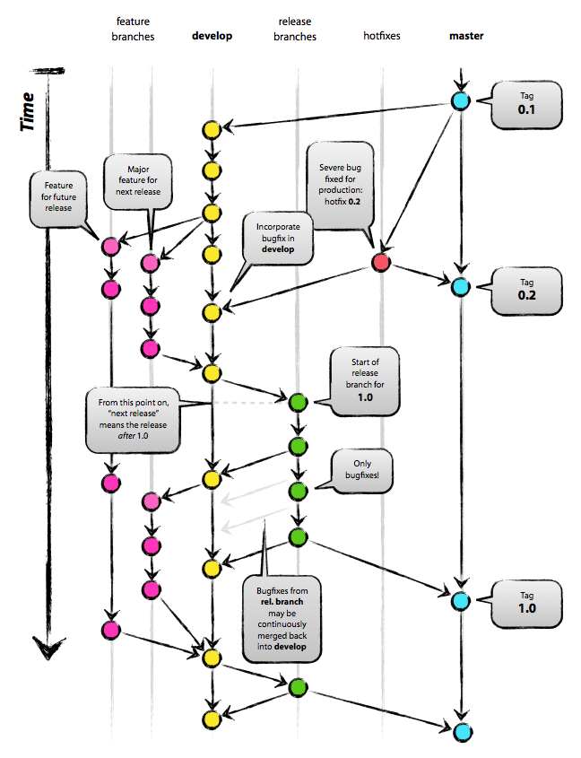

# A Hitchhikers Guide to Collaborative Software

## Agenda

- WHOAMI
- Talking to Each Other
- Design
- Review
- Good Commits
- Forking, Branching, Develop, Master?
- Testing
- Documentation
- Internationalization and Localization
- Issue Management
- Releasing
- Advanced Git Tips

# WHOAMI

# Disclaimer (Noncommercial)

## Let's Talk

<https://gitter.im/citlab/Workflows>

# Design

## Mockups: CLI

```
$ coala
/home/lasse/prog/coala/setup.py
|   2|
|    | [NORMAL] SpaceConsistencyBear:
|    | Line contains following spacing inconsistencies:
|    | - Trailing whitespaces.
|    | The following actions are applicable:
|    |  0: Apply no further actions.
|    |  1: Open the affected file(s) in an editor.
|    |  2: Apply the patch automatically.
|    |  3: Print a diff of the patch.
```

## Mockups: GUI

https://wiki.gnome.org/Design/Apps/Mail

Use the power of Inkscape!

## Mockups: API

```python
@bear(depends_on=ClangASTBear)
def ClangAnalysisBear(ClangASTBearResults: list()):
    for diagnostic in ClangASTBearResults:
        yield Result.from_clang_diagnostic(diagnostic)
```

## Note!

- Make it modular!
- Set goals!
- Set **non goals**!

## Prototyping

Walk into as many traps as possible while trying to avoid them!

## Clear Directory Structure

- Documentation
- Localization
- Source Code (if needed client/server)
- CI config files

# Review

## Why That?

- **Ensure** Understandability!
- Learn from each other.

## Quality Guidelines

- Use static code analysis!

- Hound CI
- Scrutinizer CI
- coala/GitMate

# Good Commits

## Commit Messages


## Quality Commits

- Atomic
- A **change**, not a **fix** or **feature**

## Try it Out!

<https://github.com/sils1297/Workflows/>

- Fork
- Clone your fork
- Branch off
- Commit
- Push (`git push -u origin <branchname>`)

# Forking, Branching, Develop, Master?

## Access Management

**Fork** or **branch**?

## Git Flow



## Rebase Flow


## Beware!

 * Owned branches
 * Release branches

## Excercise!

 * `git remote add orig https://github.com/sils1297/Workflows/`
 * `git checkout master && git pull orig`
 * Rebase your branch (`git rebase --interactive master`)
 * Resolve conflicts with `git mergetool` (consider installing `meld`)
 * Push with `git push --force`

# Testing

# About People...

## Automate!

- Continuous Integration
- Test against different environments
- Ensure coverage

## A Glimps Into the Future: Verification

- Prove software formally.
- Pre-, Postconditions
- Invariants

## Usability Testing

- Set up **tasks**
- Let 5-10 **people** do them
- **Do not help** them
- Let them tell you what they **think**

## Usability Testing (2)

> Run our program.

> Correct spacing of your code by using coala.

# Documentation

## Documentation Testing

```python
def add(*args):
   """
   Adds the given numbers while ignoring None's.

   >>> add(2, None, 6)
   8

   :param args: The numbers to add.
   :return:     The sum of the given numbers.
   """
   return sum((arg or 0) for arg in args)
```

## Generating Documentation

<file:///home/lasse/prog/gitmate-generic/docs/_build/html/server.views.html#server.views.static.teapot>

# Internationalization and Localization

## Internationalization

```python
from gettext import _

things_to_buy = (_('a Ford Prefect') + ' '
                 _('and') + ' ' +
                 ', '.join([_('mice'), _('towel')]))

print(_("Let's buy {}.".format(things_to_buy))
```

## Localization

- Translators shouldn't need to use git!
- Translators should have a possibility to file bugs for wrong i18n!

# Issue Management

## Categorization

- `Newcomer` bugs
- Automation
- Don't be afraid of `WONTFIX`

# Releasing

## Milestones vs. Schedule

Feature based releases?

## Tracing Changes

Updating `CHANGELOG`s sucks!

- Track a wiki page.
- Maintainer updates on release.
- Annotate commit messages.

## Backporting

Fix bugs in old releases.

- Cherry Pick

# Advanced Git Tips

## Finding Bugs

- `blame` ~~people~~ commits!
- `bisect` to find bugs

## Reworking Commits

- `rebase` onto master!
- `rebase --interactive` to batch correct commits.

## Create Aliases

Using git a lot? Use `g` instead of `git`.
